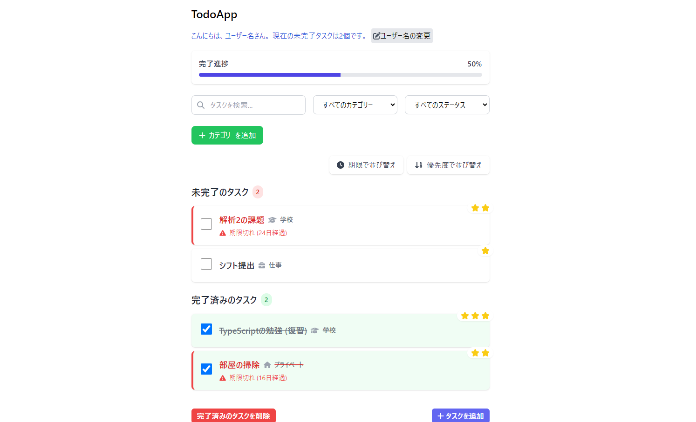
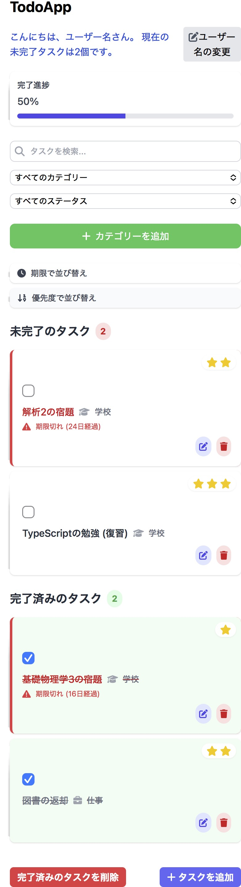

# 📝 オリジナルTodoApp

## 🌟 アプリの概要

React、TypeScript、Tailwind CSS を使用し、ローカルストレージでデータを永続化した「Todoアプリ」

## 🚀 主な機能

### 1. タスク管理の主な機能

- タスクの追加、編集、削除
- タスクの完了/未完了のトグル
- ローカルストレージによるデータ永続化
- タスクのカテゴリー化

### 2. 💡 工夫ポイント

#### 拡張タスク情報

- **優先度設定**: 1〜3段階のスター表示で直感的に優先度を設定
- **期限管理**:
  - 期限日時の設定
  - 期限切れタスクの視覚的警告
  - 残り日数の表示
 
### 3. 📁 カテゴリー管理

- **タスクカテゴリー**: タスクを仕事、学校、プライベートなどに分類。また独自のカテゴリーを作成することも可能
- **カテゴリーアイコン**: 直感的なアイコンで各カテゴリーを視覚的に識別
- **カテゴリーベースのフィルタリング**: カテゴリー別にタスクを絞り込み可能

#### UX改善機能

- 進捗状況バー
- タスクの検索・フィルタリング
- 期限・優先度による並び替え
- レスポンシブデザイン対応

### 3. インタラクティブな機能

- モーダルでのタスク追加・編集
- アニメーションとホバーエフェクト
- タスクの状態に応じた動的なスタイリング

## 🛠 使用技術スタック

- **フロントエンド**: React (TypeScript)
- **スタイリング**: Tailwind CSS
- **状態管理**: React Hooks (useState, useEffect)
- **ライブラリ**:
  - uuid (ユニークID生成)
  - react-datepicker (日付選択)
  - date-fns (日付操作)
  - FontAwesome (アイコン)

## 💭 開発背景や工夫ポイント

### チャレンジした点

1. **期限管理の拡張**:
   - 残り日数の動的計算
   - 期限切れ/緊急タスクの即座の視覚的識別
2. **ユーザビリティへのこだわり**:
   - モバイル端末向けのレスポンシブデザイン
   - 直感的なインターフェース
3. **状態管理の工夫**:
   - ローカルストレージとの連携
   - パフォーマンスを意識したuseEffectの使用
4.**カテゴリー管理の実装**:
  -タスクの分類による生産性向上
  -直感的なカテゴリー選択UI
  -拡張性を持つカテゴリーシステム
## 📊 開発概要

- 2024年10月24日：プロジェクト開始

- **開発期間**: 約2週間
- **学習時間**: およそ24時間
- **バージョン**: 1.0.0

## 📸 スクリーンショット

### デスクトップ版

### モバイル版

## 🚀 インストール & セットアップ

# リポジトリのクローン

git clone https://github.com/s-ao213/react-todo-app.git

## 使用方法

1. 新しいタスクを追加するには、「タスクを追加」ボタンをクリック
2. タスク名、優先度、期限、カテゴリーを設定
3. タスクの完了/未完了は各タスクのチェックボックスで切り替え
4. 検索バーで特定のタスクを検索可能
5. 期限や優先度、カテゴリーでタスクを並び替え可能

## 📃 ライセンス

このプロジェクトは [MIT License]の下で公開されています。
Copyright (c) 2024 s-ao213

Permission is hereby granted, free of charge, to any person obtaining a copy
of this software and associated documentation files (the "Software"), to deal
in the Software without restriction, including without limitation the rights
to use, copy, modify, merge, publish, distribute, sublicense, and/or sell
copies of the Software, and to permit persons to whom the Software is
furnished to do so, subject to the following conditions:

The above copyright notice and this permission notice shall be included in all
copies or substantial portions of the Software.

THE SOFTWARE IS PROVIDED "AS IS", WITHOUT WARRANTY OF ANY KIND, EXPRESS OR
IMPLIED, INCLUDING BUT NOT LIMITED TO THE WARRANTIES OF MERCHANTABILITY,
FITNESS FOR A PARTICULAR PURPOSE AND NONINFRINGEMENT. IN NO EVENT SHALL THE
AUTHORS OR COPYRIGHT HOLDERS BE LIABLE FOR ANY CLAIM, DAMAGES OR OTHER
LIABILITY, WHETHER IN AN ACTION OF CONTRACT, TORT OR OTHERWISE, ARISING FROM,
OUT OF OR IN CONNECTION WITH THE SOFTWARE OR THE USE OR OTHER DEALINGS IN THE
SOFTWARE.
